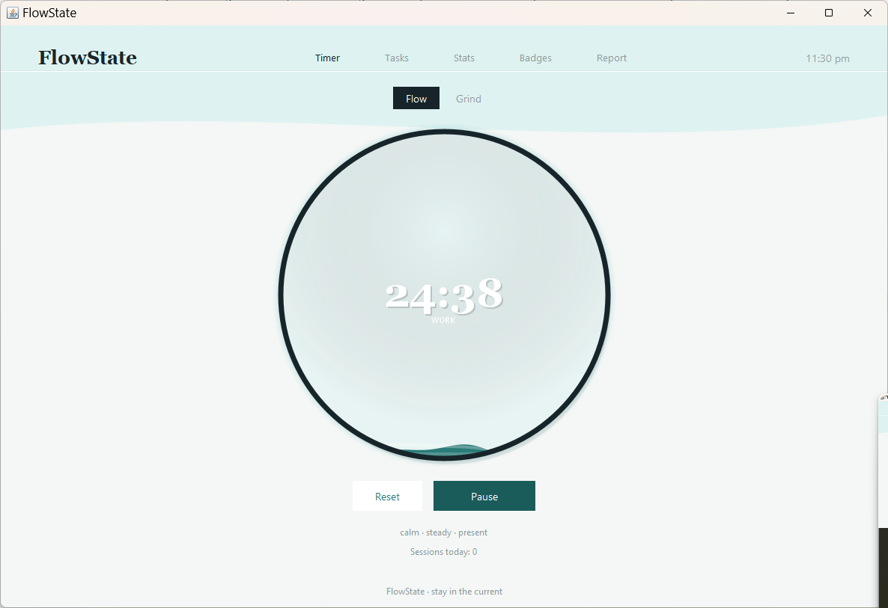
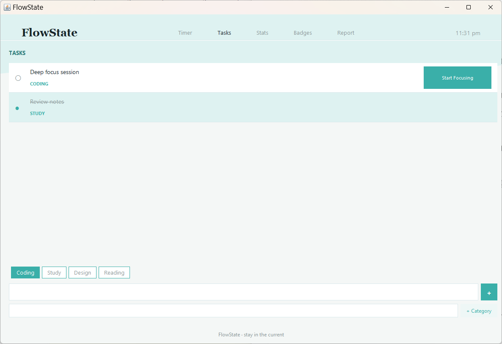
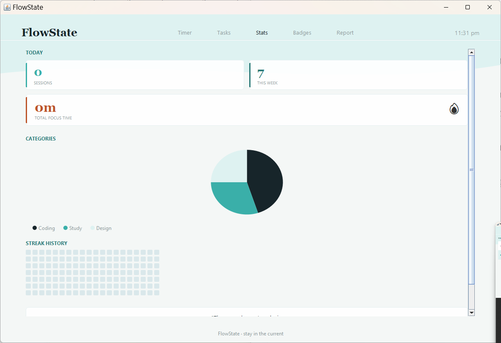
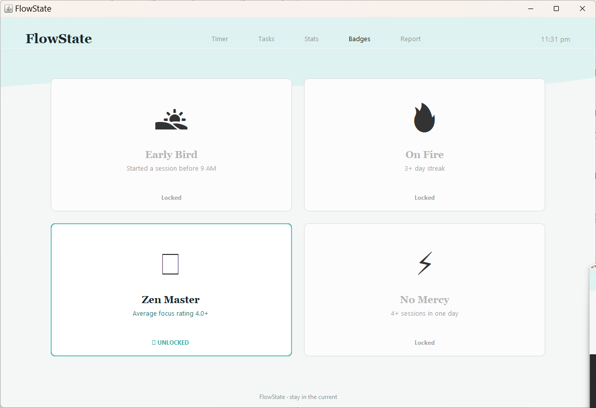
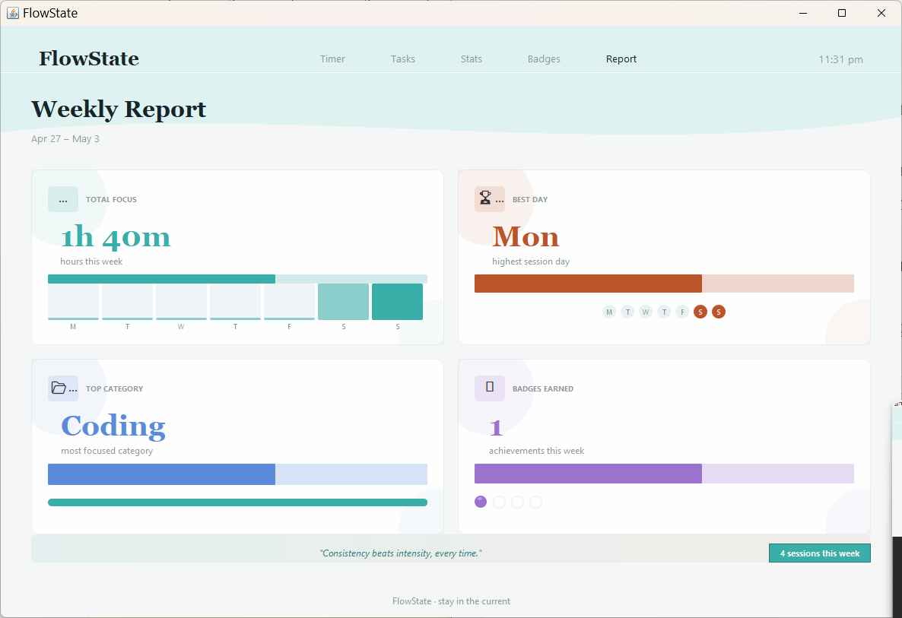

# FlowState

A Pomodoro and deep work tracker built with Java Swing. Designed around two focus modes, session tracking, and a fully animated UI built from scratch using Graphics2D with no external UI frameworks.

> "stay in the current"

---

## Screenshots

| Timer | Tasks | Stats |
|-------|-------|-------|
|  |  |  |

| Badges | Weekly Report |
|--------|---------------|
|  |  |


---

## Features

**Timer**
- Flow mode (25 min work / 5 min break) and Grind mode (50 min / 10 min)
- Sea wave animation inside the timer ring with a breathing pulse effect
- Smooth arc progress with lerp, leading white dot, and glow layer
- Post-session focus rating (1–5) that builds your Focus DNA chart

**Tasks**
- Add tasks with category tags: Coding, Study, Design, Reading
- Mark tasks active or complete; active task is linked to the running session

**Stats**
- Today's sessions, total focus time, weekly count
- Category breakdown pie chart (JFreeChart)
- GitHub-style streak heatmap drawn with Graphics2D

**Badges**
- Early Bird — started a session before 9 AM
- On Fire — 3+ day streak
- Zen Master — average focus rating 4.0+
- No Mercy — 4+ sessions in one day

**Weekly Report**
- Total focus hours, best day, top category, badges earned this week
- Motivational quote footer

**System**
- Minimizes to system tray with desktop notifications on session end
- All session data saved locally as JSON using Gson — no account, no server

---

## Tech Stack

| | |
|---|---|
| Language | Java 17 |
| Build | Maven |
| UI | Java Swing + Graphics2D |
| Charts | JFreeChart 1.5.4 |
| Persistence | Gson 2.10.1 |
| Testing | JUnit Jupiter 5.10.0 |
| CI/CD | Jenkins |

---

## CI/CD Pipeline

Every push to `main` triggers a Jenkins pipeline with 4 stages:

```
Checkout  →  Build  →  Test  →  Archive Test Results
```

Test results are published via the JUnit plugin and visible in the Jenkins build dashboard. All 6 tests pass.

| Stage | Command |
|-------|---------|
| Checkout | `git clone` |
| Build | `mvn clean package` |
| Test | `mvn test` |
| Archive | `target/surefire-reports/*.xml` |

---

## Getting Started

**Prerequisites:** JDK 17+, Maven 3.6+

```bash
git clone https://github.com/varshiniui/gui-demo.git
cd gui-demo
mvn clean package
java -jar target/gui-demo-1.0-SNAPSHOT.jar
```

---

## Running Tests

```bash
mvn test
```

6 JUnit 5 tests covering timer mode durations and time formatting:

| Test | What it checks |
|------|----------------|
| `flowModeWorkDuration` | Flow work = 25 min |
| `flowModeBreakDuration` | Flow break = 5 min |
| `grindModeWorkDuration` | Grind work = 50 min |
| `grindModeBreakDuration` | Grind break = 10 min |
| `timeFormatTwoDigits` | 90s formats as `01:30` |
| `timeFormatZero` | 0s formats as `00:00` |

---

## Project Structure

```
gui-demo/
├── Jenkinsfile
├── pom.xml
└── src/
    ├── main/java/com/demo/
    │   ├── Main.java            # entry point
    │   ├── MainWindow.java      # top-level layout and navigation
    │   ├── Theme.java           # color and font constants
    │   ├── TimerPanel.java      # timer UI, wave animation, arc progress
    │   ├── TaskPanel.java       # task management
    │   ├── StatsPanel.java      # pie chart, heatmap, session stats
    │   ├── BadgePanel.java      # badge display (locked/unlocked)
    │   ├── BadgeEngine.java     # badge unlock logic
    │   ├── DataStore.java       # Gson JSON persistence
    │   └── TrayManager.java     # system tray + desktop notifications
    └── test/java/com/demo/
        └── TimerTest.java       # 6 JUnit 5 tests
```

---

## Design

Warm cream + sage green + dusty rose theme. All colors, fonts, and spacing defined in `Theme.java`.

| Token | Value |
|-------|-------|
| Background | `#F5F0E8` |
| Panel | `#EDE8DE` |
| Sage | `#7C9E87` |
| Rose | `#C4837A` |
| Text Primary | `#3A332A` |
| Fonts | Georgia (timer), Segoe UI (body) |

---

## Author

**Varshini** — [@varshiniui](https://github.com/varshiniui)
